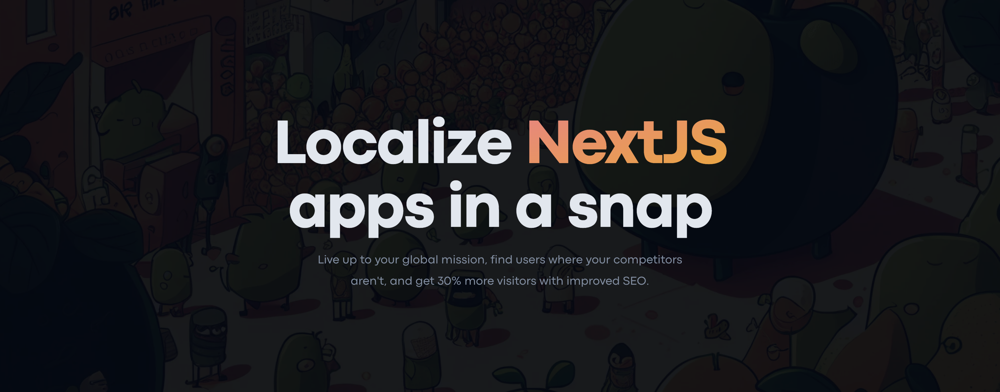

# Yuzu CLI

A full-stack toolset for NextJS localization.

  
  
  
  

## Documentation

Visit [https://withyuzu.com/docs](https://withyuzu.com/docs) to view the full documentation.

## Community

The best place to discuss Yuzu and share your project is our [Discord](https://www.withyuzu.com/discord). 
